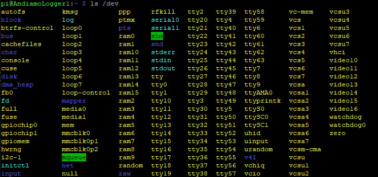
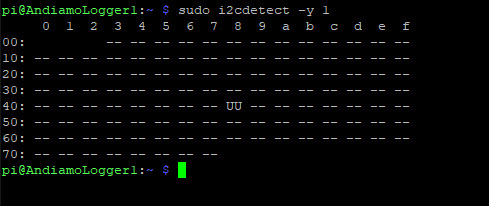

### 3v3 Serial

The RPi come switch only a single usable serial port, 
operating at 3v3, so you cannot connect it to an RS232 port.

Stackable boards are available which can be connected to the I2C bus.
The two boards tested are:

- https://www.waveshare.com/wiki/Serial_Expansion_HAT
- https://github.com/sbcshop/SB-Serial-Expansion-Hat

Both use the address 0x48 by default, so to fit more than one board, 
you need to hack around the jumpers with a soldering iron. 
In theory, you can add 16 boards in a stack! 

Enable the pi

    sudo raspi-config 
    Choose Interfacing Options -> I2C ->yes 
    sudo reboot

Copy over the source code libraries

    wget http://www.airspayce.com/mikem/bcm2835/bcm2835-1.64.tar.gz
    tar zxvf bcm2835-1.64.tar.gz 
    cd bcm2835-1.64/
    sudo ./configure
    sudo make
    sudo make check
    sudo make install

Install the required python libraries

    sudo apt-get install wiringpi
    sudo apt-get install python-dev
    sudo apt-get install python-rpi.gpio
    sudo apt-get install python-smbus
    sudo  apt-get install python-spidev

Edit the config file, adding one line

    sudo nano /boot/config.txt
    dtoverlay=sc16is752-i2c,int_pin=24,addr=0x48

Reboot and check to see if the two new ports exist as ttySC0 and ttySC1. 

Finally verify the address of the board on the I2C bus. UU means that a driver is loaded for this device.

The device has been recognized on the default 0x48.
