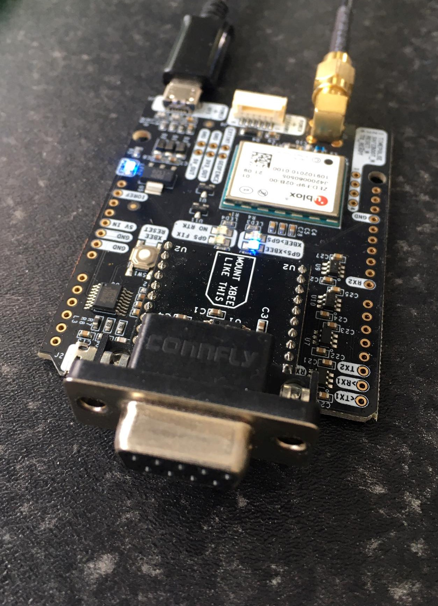

# Recipe 1: Simple test of RTK with CORS

Do some background reading on www.rtk2go.com and find the closest NTRIP mount point. 
This is just a test, so even if its some distance away, this should work.

Our test site is Umricam:2101, located north of Buncrana, Ireland, roughly at 55.166N, 7.435W.

Always take a backup of the Ardusimple configuration before you begin a configuration session. 

In U-Centre, select **Tools**, **Receiver Configuration**, set a file name and then click **Transfer GNSS->File**

Wiring:
1. Take an Ardusimple GPS and connect it to a conventional PC via USB.
2. Download and run the latest version of U-Center software from U-Blox.
3. Go to Receiver->NTRIP Client and enter in the location of the NTRIP server you are using. If its within 40kms or so, you should get RTK FIXED. If the distance is greater you may not get better than RTK FLOAT.
4. It only takes seconds for me to lock.

Note that the RTK number crunching is taking place on board the UBlox ZED9P chip.
This general approach will also work with commercial CORS services, however, these services tend to cost >€1,000/year.

Using the output data is more of a problem. What if I need the NMEA strings for an instrument, or to log? Well you can log in U-Centre, but we really need a way to get data out. There are 5 interfaces on the underlying chip. I will not discuss SPI or I2C here, that is for another recipe. But we have two UARTs, which allow serial data to be transmitted and recieved. The XBee interface on the Ardusimple board is configured for UART2 by default.  

### Warning
Serial standards like RS232, RS422 and RS485 use high voltages, +/- 15VDC. Raspberry Pi and UBlox boards use 3.3VDC. If you connect them, you will fry the board. We can connect RPi to UBlox directly, but that is for another recipe. To get data out of an Ardusimple board, we can use the RS232 interface and then configure UART2 in U-Centre to output NMEA.

I can connect this serial port back to an instrument, a logger, or back into the same laptop to use with a different piece of software. There are other ways to do this, but this is a simple and flexible solution.

I configure the following in U-Centre

- UBX-NMEA set NMEA version to 4.11 and enable high precision mode.

I configure the following in U-Centre to log the minimum data on UART2.

- UBX-PRT set UART2 protcol in to **none** and protocol out to **NMEA** 
- Set UBX-MSG-F0-00 NMEA GxGGA to **On** for UART2 for XYZ position data
- Set UBX-MSG-F0-01 NMEA GxGLL to **Off** for UART2
- Set UBX-MSG-F0-02 NMEA GxGSA to **Off** for UART2
- Set UBX-MSG-F0-03 NMEA GxGSV to **Off** for UART2
- Set UBX-MSG-F0-04 NMEA GxRMC to **On** for UART2 for COG and SOG data
- Set UBX-MSG-F0-05 NMEA GxVTG to **Off** for UART2
- Set UBX-MSG-F0-07 NMEA GxGST to **On** for UART2 for accuracy data
- Set UBX-MSG-F0-08 NMEA GxZDA to **On** for UART2 for date and time information

Also enable 2D and 3D accuary UBX sentences for U-Centre

- Set UBX-MSG 01-01 NAV-POSECEF to **On** for USB
- Set UBX-MSG 01-02 NAV-POSLLH to **On** for USB

Also set high precision mode in UBX-CFG-NMEA, you should have 7 digits after the decimal point on the NMEA output.

Before you power down, save the configuration by going to UBX-CFG Save Current Configuration and press **send**

Always take a backup of the Ardusimple configuration at the end of a configuration session. 

In U-Centre, select **Tools**, **Receiver Configuration**, set a file name and then click **Transfer GNSS->File**

