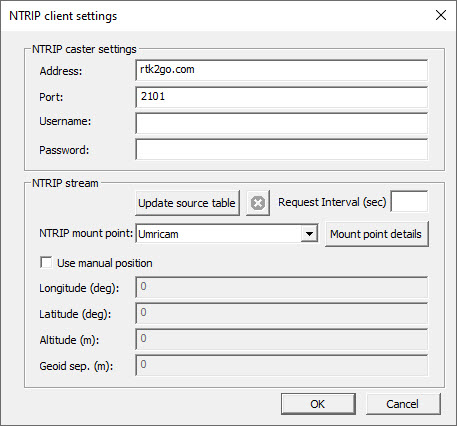
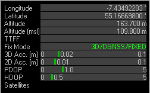

# Recipe 1: the simplest test of RTK

Do some background reading on www.rtk2go.com and find the closest NTRIP mount point. 
This is just a test, so even if its some distance away, this should work.

Our test site is Umricam:2101, located north of Buncrana, Ireland, roughly at 55.166N, 7.435W.

Wiring:
1. Take an Ardusimple GPS and connect it to a conventional PC via USB.
2. Download and run the latest version of U-Center software from U-Blox.
3. Go to Receiver->NTRIP Client and enter in the location of the NTRIP server you are using. If its within 40kms or so, you should get RTK FIXED. If the distance is greater you may not get better than RTK FLOAT.
4. It only takes seconds for me to lock.

