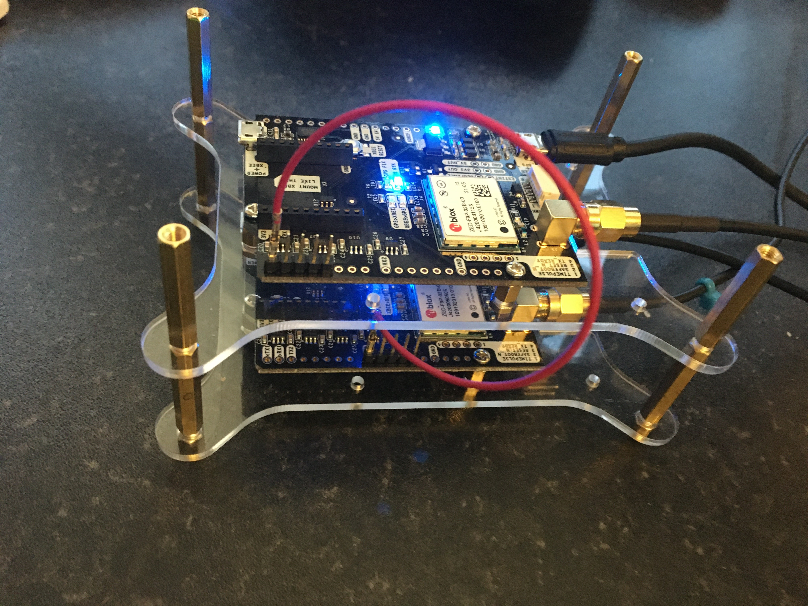

# Recipe 4: Add a heading sensor

For effective INS, we need a heading sensor. This functionality is built into the UBlox-F9P.
You can buy the kit pre-configured from Ardusimple, or construct from two SimpleRTK2B kits.

In most applications, the moving base is the main boat GNSS. It recieves corrections from a CORS station and in cm accurate.
It is configured to send RTCM data to a Rover, so the Rover can figure out where it is with respect to the moving base. 

1. Designate one kit as Moving Base and one as Rover.
2. Download the 1Hz setup files from Ardusimple and flash the two units.
3. Connect TX1 on the Moving Base to RX2 on the Rover (the red wire!).
   

4. Ensure you have an RTK Fix position on the base, you can use recipe 1 for test purposes.
5. On the Rover, use U-Centre to read UBX-NAV-RELPOSNED. This should show heading, distance and accuracy.

This is a sloppy test, in reality, GND and IOREF should also be connected.
Next projects
- Hook the Rover to a RPi and decode UBX-NAV-RELPOSNED to output NMEA0183 sentences, HDG/HDM/HDT.
- Make a second connection from the Moving Base to another Rover. Now you can calculate heading, pith, roll, yaw, etc.

